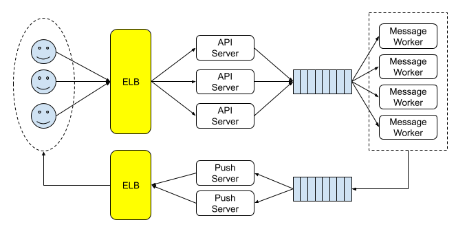

# 스타벅스 커피 주문 프로세스로 살펴보는 메세지큐(RabbitMq) 맛보기
참조 -> https://www.joinc.co.kr/w/man/12/%EC%95%84%ED%82%A4%ED%85%8D%EC%B3%90/Message
  

1. 주문대에서 주문을 받고 오더를 큐에 넣는다.(coffee-order 큐)
2. 유휴중인 바리스타가 큐에서 오더를 가져와 제조한다.(약 3초 후)
3. 제조가 완료되면 픽업대에 올려놓고 진동벨을 울린다.(coffee-result 큐)
4. 클라이언트가 와서 가져간다.(브라우저에서 Websocket, STOMP 로 받음)
